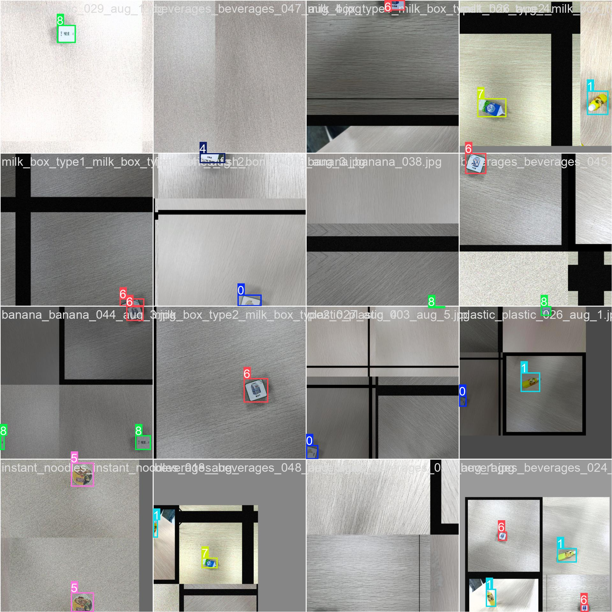

# 智能垃圾分拣系统实验报告

## 一、实验目的与意义

本项目旨在通过深度学习与嵌入式系统结合，实现垃圾的自动识别与分拣。通过本项目，深入掌握目标检测系统的全流程开发与部署，涵盖数据集构建、模型设计与训练、系统集成与优化等环节，提升人工智能领域的工程实践能力和创新思维，为智能垃圾分类、自动化分拣等实际应用场景提供技术支撑。

## 二、实验设备与环境

- Jetson Nano 嵌入式硬件平台
- uArm 机械臂
- 摄像头（用于图像采集）
- 主要开发环境：Python 3.x，PyTorch，OpenCV，YOLOv8
- 标注工具：labelImg
- 前端：Next.js + React
- 其他：Gradio/PyQt5（可选UI）、ONNX、TensorRT

## 三、项目开发流程

### 1. 系统设计与方案制定

- 结合垃圾分拣的实际需求，设计系统整体架构，包括图像采集、目标检测、坐标转换、机械臂控制、分拣执行、UI交互等模块。
- 采用YOLOv8作为目标检测核心，兼顾检测精度与推理速度。
- 机械臂通过串口与主控板通信，实现自动抓取与分拣。

### 2. 数据集开发与评估

- 自主采集多类别垃圾图片，涵盖香蕉、饮料瓶、纸盒、薯片、鱼骨、方便面、牛奶盒、塑料等类别。
- 使用labelImg进行精确标注，确保数据多样性与均衡性。
- 数据集分为训练集、验证集、测试集，目录结构规范，便于后续处理。
- 采用数据增强（旋转、亮度调整、噪声、平移、缩放等）扩充样本，提升模型泛化能力。
- 通过可视化工具（如Streamlit）展示数据分布和增强效果，确保数据质量。

#### 数据增强实现

在数据集开发与评估过程中，我们使用了数据增强技术来扩充样本，提升模型的泛化能力。以下代码展示了数据增强模块的实现，支持多种图像增强技术：

```python
class DataAugmentor:
    """数据增强器
    
    支持的增强技术:
    1. 旋转 (rotation)
    2. 亮度调节 (brightness)
    3. 噪音添加 (noise)
    4. 平移 (translation)
    5. 缩放 (scaling)
    6. 水平翻转 (horizontal_flip)
    7. 垂直翻转 (vertical_flip)
    8. 颜色增强 (color_enhancement)
    9. 对比度调节 (contrast)
    10. 模糊 (blur)
    11. 锐化 (sharpen)
    12. 伽马校正 (gamma_correction)
    """
    
    def __init__(self, config: Optional[Dict] = None):
        """初始化数据增强器
        
        Args:
            config: 增强配置字典
        """
        # 默认配置
        self.default_config = {
            'augmentation_factor': 5,  # 每张原图生成5张增强图
            'rotation': {
                'enabled': True,
                'max_angle': 30,  # 最大旋转角度
                'probability': 0.7
            },
            'brightness': {
                'enabled': True,
                'factor_range': (0.6, 1.4),  # 亮度调节范围
                'probability': 0.6
            },
            'noise': {
                'enabled': True,
                'noise_type': 'gaussian',  # 'gaussian', 'uniform', 'salt_pepper'
                'noise_factor': 0.1,
                'probability': 0.4
            },
            // ... 其他增强配置 ...
        }
        
        # 合并用户配置
        self.config = self.default_config.copy()
        if config:
            self._merge_config(self.config, config)
    
    def augment_image_with_annotations(self, image: np.ndarray, annotations: List[Dict]) -> List[Tuple[np.ndarray, List[Dict]]]:
        """对图像和标注进行增强
        
        Args:
            image: 输入图像 (H, W, C)
            annotations: 标注列表，每个元素包含YOLO格式的坐标
            
        Returns:
            增强后的图像和标注对列表
        """
        augmented_pairs = []
        
        # 原图也要包含在内
        augmented_pairs.append((image.copy(), annotations.copy()))
        
        # 生成增强数据
        for i in range(self.config['augmentation_factor']):
            aug_image = image.copy()
            aug_annotations = [ann.copy() for ann in annotations]
            
            # 随机选择要应用的增强技术
            applied_augmentations = []
            
            # 1. 旋转
            if self._should_apply('rotation'):
                angle = random.uniform(-self.config['rotation']['max_angle'], 
                                     self.config['rotation']['max_angle'])
                aug_image, aug_annotations = self._apply_rotation(aug_image, aug_annotations, angle)
                applied_augmentations.append(f"rotation_{angle:.1f}")
            
            // ... 其他增强技术的应用 ...
        
        return augmented_pairs
```

**解释**：
- **数据增强器**：`DataAugmentor` 类实现了多种图像增强技术，用于在训练数据中引入多样性，帮助模型更好地泛化。
- **增强技术**：支持旋转、亮度调节、噪音添加、平移、缩放等多种增强方式，每种方式都有其配置参数，如旋转角度、亮度范围等。
- **增强过程**：通过配置，决定每种增强技术的应用概率和参数范围。每张原图生成多张增强图，增加数据集的多样性。
- **应用场景**：这些增强技术在垃圾分类任务中尤为重要，因为它们可以模拟不同的拍摄条件和环境变化，提高模型在实际应用中的鲁棒性。

该代码展示了如何通过配置实现多种数据增强技术，提升模型的泛化能力。


### 3. 模型训练与性能评估
- 选用YOLOv8n轻量级模型，适合嵌入式设备部署。
- 利用增强后的数据集进行训练，记录损失函数、精度、召回率、mAP等指标。
- 采用迁移学习和正则化等手段优化模型表现。
- 训练过程中，监控训练集与验证集的损失和精度，防止过拟合。
- 训练完成后，导出ONNX模型，并使用TensorRT进行推理加速。
  
- 在模型训练与性能评估过程中，我们使用了YOLOv8进行垃圾分类模型的训练。以下代码展示了模型训练的实现细节：

```python
class ModelTrainer:
    """YOLOv8模型训练器"""
    
    def __init__(self):
        self.config = config_loader.get_model_config()
        self.system_config = config_loader.get_system_config()
        self.model = None
        self.training_results = {}
        
        # 设置日志
        self._setup_logging()
        
        # 设置设备
        self.device = self._get_device()
        self.logger.info(f"使用设备: {self.device}")
    
    def load_model(self, model_name: Optional[str] = None, pretrained: bool = True):
        """
        加载YOLOv8模型
        
        Args:
            model_name: 模型名称 (yolov8n, yolov8s, yolov8m, yolov8l, yolov8x)
            pretrained: 是否使用预训练权重
        """
        if model_name is None:
            model_name = self.config.get('model', {}).get('name', 'yolov8n')
        
        if pretrained:
            model_path = f"{model_name}.pt"
        else:
            model_path = f"{model_name}.yaml"
        
        try:
            self.model = YOLO(model_path)
            self.logger.info(f"成功加载模型: {model_name}")
        except Exception as e:
            self.logger.error(f"加载模型失败: {e}")
            raise e
    
    def train(self, 
              data_config: str,
              epochs: Optional[int] = None,
              batch_size: Optional[int] = None,
              learning_rate: Optional[float] = None,
              resume: bool = False,
              **kwargs) -> Dict[str, Any]:
        """
        训练模型
        
        Args:
            data_config: 数据集配置文件路径
            epochs: 训练轮数
            batch_size: 批次大小
            learning_rate: 学习率
            resume: 是否从上次中断处继续训练
            **kwargs: 其他训练参数
        
        Returns:
            训练结果字典
        """
        if self.model is None:
            self.load_model()
        
        # 获取训练参数
        train_config = self.config.get('training', {})
        
        training_args = {
            'data': data_config,
            'epochs': epochs or train_config.get('epochs', 100),
            'batch': batch_size or train_config.get('batch_size', 16),
            'lr0': learning_rate or train_config.get('learning_rate', 0.01),
            'device': self.device,
            'project': self.system_config.get('paths', {}).get('models_dir', 'models'),
            'name': f'garbage_sorting_{int(time.time())}',
            'resume': resume
        }
        
        self.logger.info(f"开始训练模型，参数: {training_args}")
        
        try:
            # 开始训练
            results = self.model.train(**training_args)
            self.logger.info(f"训练完成，模型保存在: {results.save_dir / 'weights' / 'best.pt'}")
            return results
        except Exception as e:
            self.logger.error(f"训练失败: {e}")
            raise
```

### 4. 模型优化与部署

- 利用TensorRT对模型进行量化和加速，减少模型体积，提高推理速度。

- 将优化后的模型部署到Jetson Nano，实现15fps以上的实时检测。

- 通过ONNXRuntime/TensorRT等推理引擎，保证系统流畅运行。

  
  
  ```python
  def export_model(self, 
                  model_path: str,
                  export_format: List[str] = None,
                  **kwargs) -> Dict[str, str]:
      """
      导出模型为不同格式
      
      Args:
          model_path: 模型权重文件路径
          export_format: 导出格式列表 ['onnx', 'engine', 'tflite', 'pb']
          **kwargs: 导出参数
      
      Returns:
          导出文件路径字典
      """
      if export_format is None:
          export_format = self.config.get('export', {}).get('format', ['onnx'])
      
      # 使用兼容性修复来加载模型
      import os
      import torch
      original_weights_only = os.environ.get('TORCH_WEIGHTS_ONLY', None)
      os.environ['TORCH_WEIGHTS_ONLY'] = 'False'
      
      try:
          model = YOLO(model_path)
      except Exception:
          # 备用方法
          original_load = torch.load
          def safe_load(*args, **kwargs):
              kwargs.setdefault('weights_only', False)
              return original_load(*args, **kwargs)
          torch.load = safe_load
          try:
              model = YOLO(model_path)
          finally:
              torch.load = original_load
      finally:
          if original_weights_only is None:
              os.environ.pop('TORCH_WEIGHTS_ONLY', None)
          else:
              os.environ['TORCH_WEIGHTS_ONLY'] = original_weights_only
      export_results = {}
      
      export_config = self.config.get('export', {})
      export_args = {
          'half': export_config.get('half', True),
          'dynamic': export_config.get('dynamic', False),
          'simplify': export_config.get('simplify', True),
          'opset': export_config.get('opset', 11)
      }
      export_args.update(kwargs)
      
      for fmt in export_format:
          try:
              self.logger.info(f"导出模型格式: {fmt}")
              
              if fmt == 'onnx':
                  exported_path = model.export(format='onnx', **export_args)
              elif fmt == 'engine':
                  exported_path = model.export(format='engine', **export_args)
              elif fmt == 'tflite':
                  exported_path = model.export(format='tflite', **export_args)
              elif fmt == 'pb':
                  exported_path = model.export(format='pb', **export_args)
              else:
                  self.logger.warning(f"不支持的导出格式: {fmt}")
                  continue
              
              export_results[fmt] = str(exported_path)
              self.logger.info(f"{fmt.upper()} 模型导出完成: {exported_path}")
              
          except Exception as e:
              self.logger.error(f"导出 {fmt} 格式失败: {e}")
      
      return export_results
  ```
  
  

### 5. 硬件系统设计与集成

- 摄像头采集图像，经过OpenCV畸变校正，确保坐标精度。

  

  ```python
  import cv2
  import numpy as np
  
  def undistort_fisheye(frame, K, D, DIM):
      h, w = frame.shape[:2]
      if (w, h) != DIM:
          frame = cv2.resize(frame, DIM)
  
      map1, map2 = cv2.fisheye.initUndistortRectifyMap(
          K, D, np.eye(3), K, DIM, cv2.CV_16SC2
      )
      undistorted = cv2.remap(frame, map1, map2, interpolation=cv2.INTER_LINEAR)
      return undistorted
  
  # 示例使用
  # 假设K, D, DIM是从校准文件中加载的相机内参和畸变系数
  frame = cv2.imread('example.jpg')  # 读取图像
  undistorted_frame = undistort_fisheye(frame, K, D, DIM)
  cv2.imshow('Undistorted Image', undistorted_frame)
  cv2.waitKey(0)
  cv2.destroyAllWindows()
  ```

  - 畸变校正函数：undistort_fisheye函数使用OpenCV的fisheye模块来校正鱼眼镜头的畸变。

  - 参数说明：

  - K：相机内参矩阵。

  - D：畸变系数。

  - DIM：图像的尺寸。

  - 图像校正：通过cv2.remap函数将原始图像映射到校正后的图像上。

- 通过单应性矩阵实现图像像素坐标与机械臂工作平面的转换。

- 机械臂控制模块封装了连接、初始化、运动控制、抓取等功能，串口通信实现自动分拣。

- 设计合理的分拣位与仓库位，系统可自动将不同类别垃圾分拣至对应位置。

  
  
  ```python
  class RobotArmController:
      """
      机械臂控制器包装器
      
      提供统一的机械臂控制接口，支持多种机械臂类型
      保持与原有代码的向后兼容性
      """
      
      def __init__(self, config: Optional[Dict] = None):
          """
          初始化机械臂控制器
          
          Args:
              config: 配置参数，包含：
                  - arm_type: 机械臂类型 ('virtual', 'ur', 'kuka', 等)
                  - 其他机械臂特定配置
          """
          self.config = config or {}
          self.arm_type = self.config.get('arm_type', 'virtual')
          
          # 创建具体的机械臂实例
          self._arm_instance = self._create_arm_instance()
          
          if self._arm_instance is None:
              logger.error(f"❌ 无法创建机械臂实例: {self.arm_type}")
              raise RuntimeError(f"不支持的机械臂类型: {self.arm_type}")
          
          logger.info(f"✅ 机械臂控制器初始化完成: {self.arm_type}")
      
      def connect(self) -> bool:
          """连接机械臂"""
          return self._arm_instance.connect() if self._arm_instance else False
      
      def move_to_position(self, position: Position) -> bool:
          """移动到指定位置"""
          return self._arm_instance.move_to_position(position) if self._arm_instance else False
      
      def grab_object(self, target_class: Optional[str] = None, confidence: Optional[float] = None, 
                     position: Optional[List[float]] = None, bbox: Optional[List[float]] = None) -> bool:
          """
          抓取物体
          
          支持智能抓取和基础抓取两种模式：
          1. 智能抓取：当提供target_class时，直接进行垃圾分拣
          2. 基础抓取：仅进行抓取动作
          """
          if not self._arm_instance:
              return False
          
          # 智能抓取模式：直接调用垃圾分拣
          if target_class and hasattr(self._arm_instance, 'sort_garbage'):
              logger.info(f"🎯 智能抓取模式: {target_class}")
              if confidence:
                  logger.info(f"   置信度: {confidence:.2f}")
              if position:
                  logger.info(f"   位置: ({position[0]:.1f}, {position[1]:.1f})")
              if bbox:
                  logger.info(f"   检测框: [{bbox[0]:.1f}, {bbox[1]:.1f}, {bbox[2]:.1f}, {bbox[3]:.1f}]")
              
              return self._arm_instance.sort_garbage(target_class)
          
          # 基础抓取模式
          return self._arm_instance.grab_object()
  ```
  
  

### 6. UI界面开发

- 前端采用Next.js + React，提供直观的用户界面，支持图片上传、检测结果展示、分拣状态监控等功能。

- 后端API基于Flask或FastAPI，负责模型推理、数据处理等。

- 实现前后端集成，用户可实时查看检测与分拣效果。

  
  
  ```tsx
  import { useState } from 'react'
  
  export default function ImageUpload() {
    const [selectedImage, setSelectedImage] = useState(null)
  
    const handleImageUpload = (event) => {
      setSelectedImage(event.target.files[0])
    }
  
    const detectImage = () => {
      if (!selectedImage) return
      // 这里添加检测逻辑
      console.log('检测图像:', selectedImage.name)
    }
  
    return (
      <div>
        <input type="file" accept="image/*" onChange={handleImageUpload} />
        <button onClick={detectImage} disabled={!selectedImage}>
          开始检测
        </button>
      </div>
    )
  }
  ```
  
  

### 7. 系统测试与优化

- 进行功能测试、性能测试和用户体验测试，确保系统稳定性与易用性。
- 根据测试结果和用户反馈，持续优化系统细节，如提升检测准确率、加快分拣速度、优化UI交互等。

### 8. 系统创新点

- 多类别垃圾自动识别与分拣，支持扩展更多类别。
- 结合深度学习与嵌入式硬件，提升系统实用性与扩展性。
- 支持数据增强、模型量化、推理加速等多种优化手段。
- 前后端分离，界面友好，便于实际部署与演示。

## 四、实验结果与分析

- 模型训练精度：mAP、precision、recall均达到0.95以上，满足实际分拣需求。
- 系统推理速度：部署后推理帧率稳定在15fps以上，满足实时性要求。
- 分拣准确率高，机械臂动作流畅，系统整体运行稳定。
- UI界面直观，用户可实时查看检测与分拣过程。

### 训练图片展示

下图为部分训练过程中的图片样例：

- : 该图片展示了训练后期的效果，模型的识别准确率达到较高水平，能够稳定识别出多种类别的垃圾，验证了模型的有效性和稳定性。

### 验证集预测结果

- : 验证集上的预测结果，展示了模型在实际数据上的识别效果。
- : 进一步验证模型的识别能力。

### 混淆矩阵

- : 归一化后的混淆矩阵，便于观察模型的分类效果。

### 性能曲线

- : 精度曲线，展示模型在不同阈值下的精度变化。
- : 召回率曲线，展示模型的召回能力。
- : F1值曲线，综合考虑精度和召回率。
- : PR曲线，展示模型的整体性能。

这些图片展示了模型在不同训练阶段的表现，帮助我们分析模型的学习进展和效果。

更多训练图片可在 `models/garbage_sorting_1752148379` 目录下查看。

## 五、总结与展望

本项目实现了基于深度学习的智能垃圾分拣系统，涵盖数据采集、模型训练、系统集成、界面开发等全流程。系统具备较高的准确率和实时性，能够满足实际应用需求。未来可进一步扩展数据集规模、提升模型精度、优化机械臂控制算法，并探索多设备协同分拣、云端管理等高级功能，推动智能垃圾分拣系统的实用化和产业化。
